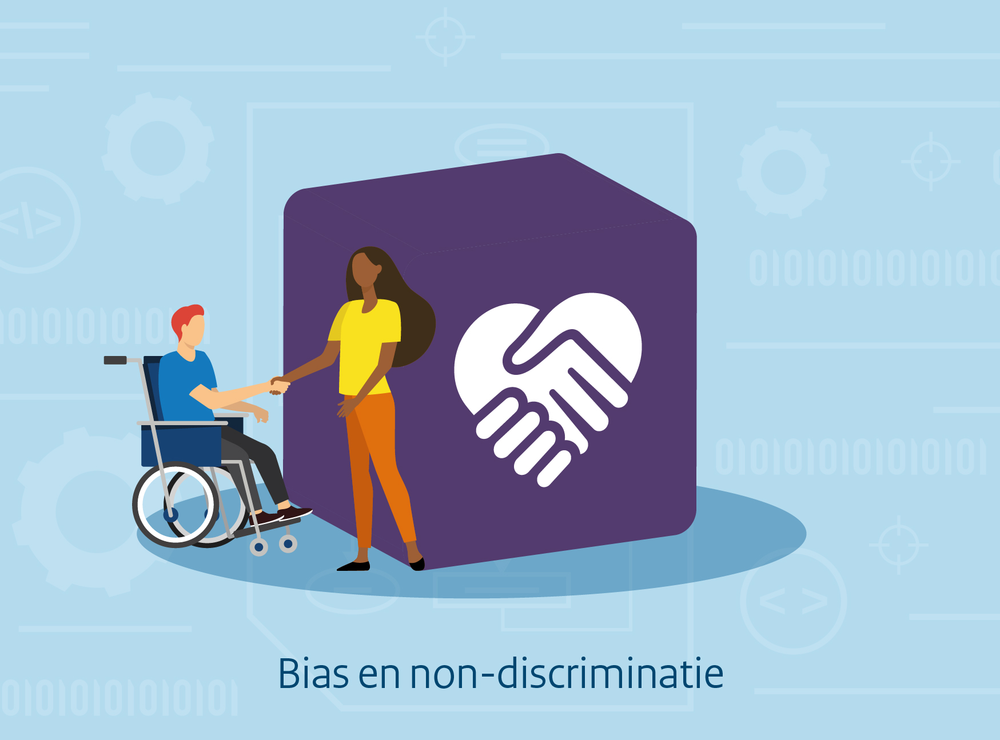

{align="right"; width="50%"}

Algoritmes worden binnen de overheid veelvuldig ingezet om publieke taken uit te voeren. Dit biedt veel kansen, maar er zijn ook risico's aan verbonden.
Hoewel algoritmes in sommige gevallen kunnen bijdragen aan het tegengaan van discriminatie, kan bias in het algoritme leiden tot een ongelijke en oneerlijke behandeling van burgers of groepen, en kan er sprake zijn van discriminerende effecten. 
In dit bouwblok van het algoritmekader besteden we aandacht aan de onderwerpen bias, eerlijkheid en non-discriminatie. 
We werken uit wat bias is, hoe bias kan ontstaan, hoe we dit kunnen signaleren, welke maatregelen er genomen kunnen worden om dit te voorkomen en geven we handvatten wat te doen wanneer een (onwenselijke) bias is gesignaleerd. 

Hierbij is het goed om op te merken dat het omgaan met het thema bias gedurende het ontwikkelen, inkopen of gebruik van het algoritme vraagt om continue aandacht voor dit onderwerp. 
Het betreft geen probleem dat eenmalig kan worden weggenomen. Het vraagt voortdurend om reflectie op eerlijkheid en rechtvaardigheid van het systeem. 

Dit bouwblok wordt uitgewerkt in vereisten die weergeven wat er vanuit wet- en regelgeving en bestaande toetsingskaders vereist is om bias en discriminatie tegen te gaan. 
Daarbij worden er suggesties gedaan hoe deze vereisten kunnen worden nageleefd met concrete maatregelen, en welke actoren daarbij betrokken kunnen zijn. 
Waar mogelijk worden concrete voorbeelden en best practices uit de praktijk gegeven en zal worden aangegeven bij welk type algoritmen of AI dit relevant is.
Deze vereisten en maatregelen worden ook gekoppeld aan de algoritme levenscyclus. 
Dit geeft een beeld van wanneer bepaalde vereisten of maatregelen, bij het ontwikkelen van algoritmen en AI, moeten worden geadresseerd.   

Door bij de ontwikkeling van algoritmes rekening te houden met vereisten die voorkomen uit wet- en regelgeving, het type algoritme of AI en de potentiële risico’s die ontstaan bij het gebruiken ervan, kunnen negatieve gevolgen worden voorkomen. 
 
De onderwerpen bias en non-discriminatie spelen daarom een belangrijke rol bij de totstandkoming van verantwoord ontwikkelde algoritmen en AI en het gebruik daarvan door ambtenaren. 

## Wat is discriminatie en bias?

### Discriminatie
[Artikel 1 van de Nederlandse Grondwet](https://wetten.overheid.nl/jci1.3:c:BWBR0001840&hoofdstuk=1&artikel=1&z=2023-02-22&g=2023-02-22) verbiedt discriminatie: 

> Allen die zich in Nederland bevinden, worden in gelijke gevallen gelijk behandeld. Discriminatie wegens godsdienst, levensovertuiging, politieke gezindheid, ras, geslacht, handicap, seksuele gerichtheid of op welke grond dan ook, is niet toegestaan. 

De prominente positie in de Grondwet benadrukt het belang van het mensenrecht in Nederland. 
De afgelopen jaren hebben incidenten in de praktijk de aandacht gericht op de discriminatoire effecten die algoritmes en AI-systemen kunnen hebben.

### Bias
*Bias* is een Engelse term die in het Nederlands wordt vertaald als vooroordeel, vooringenomenheid of neiging. 
Omdat niet één van die termen helemaal de lading van het begrip *bias* dekt, maken we in het Algoritmekader gebruik van de term *bias*. 
De term *bias* heeft verschillende betekenissen afhankelijk van de context waarin het gebruikt wordt en de disciplines die daarbij betrokken zijn. 
Vaak wordt er naar bias gekeken als een technisch concept, maar het omvat daarnaast ook menselijke aspecten. 
We starten met een verduidelijking hoe het begrip bias in algoritmische context gebruikt wordt en hoe dit in verhouding staat tot discriminatie. 
Vervolgens maken we onderscheid tussen drie verschillende aspecten van bias: statistische bias, systemische bias en menselijke bias. 
Deze drie aspecten van bias kunnen los van elkaar bestaan, maar kunnen juist in combinatie met elkaar tot problemen leiden. 

#### Bias in algoritmische context
Het concept bias wordt in algoritmische context gedefinieerd als *een systematisch verschil in behandeling van bepaalde objecten, mensen of groepen in vergelijking met anderen*.[^2]

[^2]: Zie [ISO/IEC TR 24027:2021 en](https://www.nen.nl/iso-iec-tr-24027-2021-en-289193) [^3]

Dit systematische verschil of onderscheid kan zowel op een directe als op een indirecte manier ontstaan. 

> De [Algemene wet gelijke behandeling](https://wetten.overheid.nl/BWBR0006502/2020-01-01) spreekt van **direct onderscheid** wanneer *een persoon op een andere wijze wordt behandeld dan een ander in een vergelijkbare situatie wordt, is of zou worden behandeld, op grond van godsdienst, levensovertuiging, politieke gezindheid, ras, geslacht, nationaliteit, hetero- of homoseksuele gerichtheid [^6] of burgerlijke staat*.

> De [Algemene wet gelijke behandeling](https://wetten.overheid.nl/BWBR0006502/2020-01-01) spreekt van **indirect onderscheid** indien *een ogenschijnlijk neutrale bepaling, maatstaf of handelwijze personen met een bepaalde godsdienst, levensovertuiging, politieke gezindheid, ras, geslacht, nationaliteit, hetero- of homoseksuele gerichtheid [^6] of burgerlijke staat in vergelijking met andere personen bijzonder treft*. 

[^6]: Er is een [wetsvoorstel](https://www.rijksoverheid.nl/actueel/nieuws/2024/01/26/wetsvoorstel-wijziging-algemene-wet-gelijke-behandeling-en-wetboek-van-strafrecht-naar-tweede-kamer) om de term 'hetero- of homoseksuele gerichtheid' in de Algmemene wet gelijke behandeling (Awgb) te wijzigingen in 'seksuele gerichtheid'.  Met deze wijziging sluit de Awgb aan bij een eerdere wijziging van artikel 1 van de Grondwet.

Een geconstateerd systematische onderscheid is niet altijd fout en is niet altijd verboden, maar het vraagt wel altijd om aandacht en zorgvuldigheid. 
Het geconstateerde onderscheid kan in bepaalde situaties en onder bepaalde strikte voorwaarden gerechtvaardigd zijn. 
Voor direct onderscheid kan er bijvoorbeeld sprake zijn van een wettelijke uitzondering die het gemaakte onderscheid toelaat. 
Voor indirect onderscheid geldt dat behalve een wettelijke uitzondering er ook een objectieve rechtvaardiging kan bestaan, waarmee het geconstateerde onderscheid in bepaalde gevallen toelaatbaar kan zijn. 

Het maken van een eventueel onderscheid is in sommige gevallen nauw verbonden met het gebruik van algoritmes en AI. 
Soms worden algoritmes en AI bijvoorbeeld juist ingezet om op een zo objectief mogelijke manier te bepalen welke groepen meer of minder belang hebben bij een andere behandeling. 
In deze gevallen zal er altijd na moeten worden gegaan of er sprake is van een objectieve rechtvaardiging voor het gemaakte onderscheid.

Wanneer er geen rechtvaardiging is voor het gemaakte onderscheid, spreken we van een verboden direct of indirect onderscheid, ofwel discriminatie. 
Het algoritme of AI-systeem mag in dat geval niet gebruikt worden.
Bias vormt daarmee een risico op discriminatie.

##### Fairness 
In de context van algoritmes en AI wordt de term *unfairness* gebruikt wanneer er sprake is van een ongerechtvaardigd onderscheid waarbij bepaalde groepen meer bevoordeeld worden dan andere.[^5] 
In de Nederlandse taal spreken we dan van oneerlijkheid of onrechtvaardigheid (of in positieve zin van respectievelijk fairness, eerlijkheid en rechtvaardigheid). 
Wanneer we het hebben over fairness hebben we het minder over de juridische kant van discriminatie en verboden onderscheid. 
Ook als er wel een objectieve rechtvaardiging bestaat voor een gemaakt onderscheid, kan afgevraagd worden of het gemaakte onderscheid ethisch wenselijk is. 

[^5]: Zie [NEN-EN-ISO/IEC 22989:2023 en](https://www.nen.nl/nen-en-iso-iec-22989-2023-en-312642) [^3] 

#### Statistische bias
Statistische bias wordt gedefinieerd als *een consistente numerieke afwijking van een schatting ten opzichte van de werkelijke onderliggende waarde*.[^2]
Dit fenomeen kan in allerlei verschillende contexten plaatsvinden, niet alleen bij het gebruik van algoritmes of AI. 
Een voorbeeld is wanneer een bepaalde meting van een waarde niet goed gekalibreerd is en er sprake is van een consistente afwijking van de te meten waarde (bijvoorbeeld dat we consistent 10% hoger meten). 

In de context van algoritmes en AI kan deze vorm van bias voorkomen wanneer er een steekproef wordt gebruikt die niet representatief is voor de populatie, en de schattingen op basis van de steekproef vervolgens systematisch afwijken van de werkelijke waarde in de gebruikte doelpopulatie.
Statistische bias duidt op een systematische fout die gemaakt wordt door het algoritme. 
Deze fout kan hetzelfde zijn voor alle groepen en hoeft daardoor niet in alle gevallen te duiden op ongelijke behandeling of discriminerende effecten. 
Voorbeelden van statistische bias zijn meetfouten (measurement bias), foute data of data op een te simpele manier representeren (representatie bias).

[^2]: Zie [ISO/IEC TR 24027:2021 en](https://www.nen.nl/iso-iec-tr-24027-2021-en-289193) [^3]

#### Systemische bias 
We spreken van systemische bias wanneer bepaalde processen of systemen op zo'n wijze worden gebruikt dat bepaalde groepen bevoordeeld worden en andere groepen benadeeld worden.
Dit is vaak geen bewuste vorm van vooringenomenheid, maar kan bijvoorbeeld ontstaan doordat de meerderheid bestaande regels of normen volgt, en het systeem geoptimaliseerd is op de meerderheid.
Systemische bias heeft een sterk institutioneel karakter. Systemische bias wordt daarom ook wel institutionele vooringenomenheid genoemd. 
Deze vooroordelen zijn vaak verweven in de bredere cultuur en samenleving, en zitten daardoor ook in veel datasets. 
Een veel voorkomend voorbeeld van systemische bias is historische bias. 

#### Menselijke bias 
Menselijke bias omvat systematische fouten in het menselijk denken. 
Deze (onbewuste) menselijke vooroordelen zijn vaak impliciet van aard en hebben betrekking op de manier waarop een individu bepaalde informatie waarneemt en verwerkt om bijvoorbeeld een beslissing te nemen. 
In de context van algoritmes kan deze vorm van bias invloed hebben op de verzamelde data, op de wijze waarop het algoritme wordt geoptimaliseerd en de besluiten die door mensen worden genomen op basis van het algoritme.
Voorbeelden van vormen menselijke bias zijn wanneer er voorkeur wordt geven aan de voorspellingen van een algoritme die reeds bestaande overtuigingen bevestigen (bevestigingsbias), of wanneer mensen de neiging hebben om voorkeur te geven aan suggesties die door het algoritme worden gedaan (automatiseringsbias)

## Overzicht van gebruikte definities
Onderstaand bieden we een overzicht van de gebruikte definities in het algoritmekader die betrekking hebben op het onderwerp bias en non-discriminatie. 

| Term of begrip               | Definitie                                                                                                                                                                                                                                                                                                            | Bron                                                                                                                                                                                      |
|------------------------------|----------------------------------------------------------------------------------------------------------------------------------------------------------------------------------------------------------------------------------------------------------------------------------------------------------------------|-------------------------------------------------------------------------------------------------------------------------------------------------------------------------------------------|
| direct onderscheid           | indien een persoon op een andere wijze wordt behandeld dan een ander in een vergelijkbare situatie wordt, is of zou worden behandeld, op grond van godsdienst, levensovertuiging, politieke gezindheid, ras, geslacht, nationaliteit, hetero- of homoseksuele gerichtheid[^6] of burgerlijke staat                   | [Algemene wet gelijke behandeling](https://wetten.overheid.nl/BWBR0006502/2020-01-01)                                                                                                     |
| indirect onderscheid         | indien een ogenschijnlijk neutrale bepaling, maatstaf of handelwijze personen met een bepaalde godsdienst, levensovertuiging, politieke gezindheid, ras, geslacht, nationaliteit, hetero- of homoseksuele gerichtheid[^6] of burgerlijke staat in vergelijking met andere personen bijzonder treft.                  | [Algemene wet gelijke behandeling](https://wetten.overheid.nl/BWBR0006502/2020-01-01)                                                                                                     |
| discriminatie                | mensen anders behandelen, achterstellen of uitsluiten op basis van (persoonlijke) kenmerken.                                                                                                                                                                                                                         | [College voor de rechten van de mens](https://www.mensenrechten.nl/mensenrechten-voor-jou/discriminatie-en-gelijke-behandeling/wat-is-discriminatie)                                      |
| directe discriminatie        | de ongelijke behandeling van een persoon of groep personen ten opzichte van andere personen in een vergelijkbare situatie, op grond van een beschermd persoonskenmerk (discriminatiegrond).                                                                                                                          | [College voor de rechten van de mens, Discriminatie door risicoprofielen - een mensenrechtelijk toetsingskader](https://publicaties.mensenrechten.nl/publicatie/61a734e65d726f72c45f9dce) |
| indirecte discriminatie      | wanneer een ogenschijnlijk neutrale bepaling, maatstaf of handelwijze personen met een bepaald beschermd persoonskenmerk (discriminatiegrond) in vergelijking met andere personen in het bijzonder benadeelt, tenzij hiervoor een objectieve rechtvaardiging bestaat.                                                | [College voor de rechten van de mens, Discriminatie door risicoprofielen - een mensenrechtelijk toetsingskader](https://publicaties.mensenrechten.nl/publicatie/61a734e65d726f72c45f9dce) |
| algoritmische fairness       | het vakgebied dat bestudeert hoe algoritmische systemen zich moeten gedragen om mensen eerlijk te behandelen, dat wil zeggen zonder discriminatie op grond van beschermde gevoelige kenmerken zoals leeftijd, geslacht, handicap, etnische of raciale afkomst, religie of geloofsovertuiging, of seksuele geaardheid | [The fairness handbook](https://openresearch.amsterdam/en/media/inline/2022/7/14/fairness_handbook.pdf)                                                                                   |
| ground truth (NL vertaling?) | waarde van de doelvariabele voor een bepaald item van gelabelde invoergegevens. [^4]                                                                                                                                                                                                                                 | [NEN-EN-ISO/IEC 22989:2023 en](https://www.nen.nl/nen-en-iso-iec-22989-2023-en-312642) [^3]                                                                                               |
| etnisch profileren           | Het gebruik door overheidsinstanties van selectiecriteria als ras, huidskleur, taal, religie, nationaliteit of nationale of etnische afkomst bij de uitoefening van toezichts-, handhavings- en opsporingsbevoegdheden, zonder dat daarvoor een objectieve en redelijke rechtvaardiging bestaat.                     | [College voor de rechten van de mens, Discriminatie door risicoprofielen - een mensenrechtelijk toetsingskader](https://publicaties.mensenrechten.nl/publicatie/61a734e65d726f72c45f9dce) |
| discriminatiegrond           | Beschermde persoonskenmerken op basis waarvan het maken van onderscheid tussen personen verboden is. Bijvoorbeeld: ras, nationaliteit, religie, geslacht, seksuele gerichtheid, handicap of chronische ziekte                                                                                                        | [College voor de rechten van de mens, Discriminatie door risicoprofielen - een mensenrechtelijk toetsingskader](https://publicaties.mensenrechten.nl/publicatie/61a734e65d726f72c45f9dce) |
| risicoprofiel                | Een verzameling van één of meer selectiecriteria op basis waarvan een bepaald risico op normovertreding wordt ingeschat en een selectiebeslissing wordt gemaakt.                                                                                                                                                     | [College voor de rechten van de mens, Discriminatie door risicoprofielen - een mensenrechtelijk toetsingskader](https://publicaties.mensenrechten.nl/publicatie/61a734e65d726f72c45f9dce) |
| groep                        | deelverzameling van objecten in een domein die zijn gekoppeld omdat ze gemeenschappelijke kenmerken hebben.                                                                                                                                                                                                          | [ISO/IEC TR 24027:2021 en](https://www.nen.nl/iso-iec-tr-24027-2021-en-289193) [^3]                                                                                                       |

[^3]: Hoewel het gebruik van de NEN-ISO-normen in het Algoritmekader auteursrechtelijk is beschermd, heeft het Nederlands Normalisatie Instituut (NEN) voor het gebruik in het Algoritmekader toestemming verleend. Zie [nen.nl](https://www.nen.nl/) voor meer informatie over NEN en het gebruik van hun producten.
[^4]: De term ground truth impliceert niet dat de gelabelde invoergegevens consistent overeenkomen met de werkelijke waarde van de doelvariabelen.

### Verschillende vormen van bias
Omdat bias op verschillende manieren kan ontstaan, zijn er allerlei verschillende vormen van bias, die hieronder gedefinieerd worden. Deze lijst is niet uitputtend. 

| Begrip              | Definitie                                                                                                                                                                                                                                                                                                                                                                                                          | Bron                                                                                                                                                                                              |
|---------------------|--------------------------------------------------------------------------------------------------------------------------------------------------------------------------------------------------------------------------------------------------------------------------------------------------------------------------------------------------------------------------------------------------------------------|---------------------------------------------------------------------------------------------------------------------------------------------------------------------------------------------------|
| automatiseringsbias | de neiging van mensen om de voorkeur te geven aan suggesties van geautomatiseerde besluitvormingssystemen en om tegenstrijdige informatie te negeren die zonder automatisering is verkregen, zelfs als deze correct is                                                                                                                                                                                             | [ISO/IEC TR 24027:2021 en](https://www.nen.nl/iso-iec-tr-24027-2021-en-289193) [^3]                                                                                                               |
| data bias           | dataeigenschappen die, als ze niet worden aangepakt, leiden tot AI-systemen die beter of slechter presteren voor verschillende groepen                                                                                                                                                                                                                                                                             | [ISO/IEC TR 24027:2021 en](https://www.nen.nl/iso-iec-tr-24027-2021-en-289193) [^3]                                                                                                               |
| statistische bias   | soort consistente numerieke afwijking in een schatting ten opzichte van de werkelijke onderliggende waarde, inherent aan de meeste schattingen                                                                                                                                                                                                                                                                     | [ISO/IEC TR 24027:2021 en](https://www.nen.nl/iso-iec-tr-24027-2021-en-289193) [^3]                                                                                                               |
| historische bias    | verwijzend naar de langdurige vooroordelen die in de loop der tijd in de samenleving zijn gecodeerd. Verwant aan, maar verschillend van, vooroordelen in historische beschrijving, of de interpretatie, analyse en verklaring van de geschiedenis. Een veel voorkomend voorbeeld van historische vooringenomenheid is de neiging om de wereld te bekijken vanuit een Westers of Europees perspectief               | [NIST, Towards a Standard for identifying and managing bias in artificial intelligence](https://www.nist.gov/publications/towards-standard-identifying-and-managing-bias-artificial-intelligence) |
| activiteitenbias    | een soort selectievooroordeel dat optreedt wanneer systemen/platforms hun trainingsgegevens krijgen van de meest actieve gebruikers, in plaats van minder actieve (of inactieve) gebruikers.                                                                                                                                                                                                                       | [NIST, Towards a Standard for identifying and managing bias in artificial intelligence](https://www.nist.gov/publications/towards-standard-identifying-and-managing-bias-artificial-intelligence) |
| versterkingsbias    | ontstaat wanneer de verdeling over voorspellingsoutputs scheef is in vergelijking met de prior-verdeling van het voorspellingsdoel.                                                                                                                                                                                                                                                                                | [NIST, Towards a Standard for identifying and managing bias in artificial intelligence](https://www.nist.gov/publications/towards-standard-identifying-and-managing-bias-artificial-intelligence) |
| cognitieve bias     | een brede term die in het algemeen verwijst naar een systematisch patroon van afwijking van rationele oordeels- en besluitvorming. In vele decennia van onderzoek naar oordeelsvorming en besluitvorming is een grote verscheidenheid aan cognitieve vertekeningen geïdentificeerd, waarvan sommige adaptieve mentale snelkoppelingen zijn die bekend staan als heuristieken.                                      | [NIST, Towards a Standard for identifying and managing bias in artificial intelligence](https://www.nist.gov/publications/towards-standard-identifying-and-managing-bias-artificial-intelligence) |
| bevestigingsbias    | soort menselijke cognitieve bias die de voorkeur geeft aan voorspellingen van AI-systemen die reeds bestaande overtuigingen of hypotheses bevestigen                                                                                                                                                                                                                                                               | [ISO/IEC TR 24027:2021 en](https://www.nen.nl/iso-iec-tr-24027-2021-en-289193) [^3]                                                                                                               |
| implementatie bias  | ontstaat wanneer systemen worden gebruikt als beslissingshulp voor mensen, omdat de menselijke tussenpersoon kan handelen op voorspellingen op manieren die meestal niet zijn gemodelleerd in het systeem. Het zijn echter nog steeds individuen die het gebruikte systeem gebruiken                                                                                                                               | [NIST, Towards a Standard for identifying and managing bias in artificial intelligence](https://www.nist.gov/publications/towards-standard-identifying-and-managing-bias-artificial-intelligence) |
| evaluatie bias      | ontstaat wanneer de test- of externe benchmarkpopulaties niet in gelijke mate de verschillende delen van de gebruikerspopulatie vertegenwoordigen of door het gebruik van prestatiemaatstaven die niet geschikt zijn voor de manier waarop het model zal worden gebruikt                                                                                                                                           | [NIST, Towards a Standard for identifying and managing bias in artificial intelligence](https://www.nist.gov/publications/towards-standard-identifying-and-managing-bias-artificial-intelligence) |
| meetbias            | ontstaat wanneer kenmerken en labels benaderingen zijn voor gewenste grootheden, waarbij mogelijk belangrijke factoren worden weggelaten of groeps- of ingangsafhankelijke ruis wordt geïntroduceerd die leidt tot differentiële prestaties.                                                                                                                                                                       | [NIST, Towards a Standard for identifying and managing bias in artificial intelligence](https://www.nist.gov/publications/towards-standard-identifying-and-managing-bias-artificial-intelligence) |
| representatie bias  | ontstaat doordat subgroepen niet willekeurig worden geselecteerd in een steekproef, waardoor trends die voor één populatie worden geschat, niet generaliseerbaar zijn naar gegevens van een nieuwe populatie                                                                                                                                                                                                       | [NIST, Towards a Standard for identifying and managing bias in artificial intelligence](https://www.nist.gov/publications/towards-standard-identifying-and-managing-bias-artificial-intelligence) |

### Discriminatiegrond

De discriminatiegrond beschrijft de beschermde persoonskenmerken op basis waarvan het maken van onderscheid tussen personen verboden is. Deze gronden zijn in verschillende bronnen vastgelegd. 

#### De grondwet
De [Grondwet](https://wetten.overheid.nl/BWBR0001840/2023-02-22) stelt dat discriminatie wegens:

- godsdienst 
- levensovertuiging 
- politieke gezindheid 
- ras 
- geslacht 
- handicap
- seksuele gerichtheid
- of op welke grond dan ook

niet is toegestaan. 

#### De Algemene wet gelijke behandeling
De [Algemene wet gelijke behandeling](https://wetten.overheid.nl/BWBR0006502/2020-01-01) legt een verbod onderscheid neer op grond van:

- godsdienst
- levensovertuiging
- politieke gezindheid
- ras
- geslacht
- nationaliteit
- hetero- of homoseksuele gerichtheid [^6]
- of burgelijke staat. 
  
Het in deze wet neergelegde verbod van onderscheid geldt niet ten aanzien van indirect onderscheid indien dat onderscheid objectief gerechtvaardigd wordt door een legitiem doel en de middelen voor het bereiken van dat doel passend en noodzakelijk zijn.

#### Europees Verdrag voor de Rechten van de Mens
Het [Europees Verdrag voor de Rechten van de Mens, artikel 14](https://www.echr.coe.int/documents/d/echr/convention_nld) stelt dat het genot van de rechten en vrijheden die in dat verdrag zijn vermeld, moet worden verzekerd zonder enig onderscheid op welke grond dan ook, zoals:

- geslacht
- ras
- kleur
- taal
- godsdienst
- politieke of andere mening
- nationale of maatschappelijke afkomst
- het behoren tot een nationale minderheid
- vermogen
- geboorte
- of andere status. 

#### Handvest van de grondrechten van de Europese Unie
Het [Handvest van de grondrechten van de Europese Unie, artikel 21](https://eur-lex.europa.eu/legal-content/NL/TXT/PDF/?uri=CELEX:12016P/TXT) stelt dat iedere discriminatie, met name op grond van:

- geslacht
- ras
- kleur
- etnische of sociale afkomst
- genetische kenmerken
- taal
- godsdienst
- politieke of andere denkbeelden
- het behoren tot een nationale minderheid
- vermogen
- geboorte
- een handicap
- leeftijd
- of seksuele gerichtheid

is verboden. Daarnaast wordt expliciet vermeld dat binnen de werkingssfeer van de Verdragen en onverminderd de bijzondere bepalingen ervan, iedere discriminatie op grond van nationaliteit verboden is.

!!! info "Disclaimer"

    Het Algoritmekader is nog volop in ontwikkeling. Op deze plek willen we vooral aan de slag gaan op een open en transparante wijze. Het is dus niet definitief. Dat betekent dat er dingen opstaan die niet af zijn en soms zelfs fout. Mocht er iets niet kloppen, laat het ons weten via [GitHub](https://github.com/MinBZK/Algoritmekader).
    
## Vereisten

<!-- list_vereisten bouwblok/bias-en-non-discriminatie -->

## Maatregelen

<!-- list_maatregelen bouwblok/bias-en-non-discriminatie -->

## Mogelijke hulpmiddelen en methoden
* [Fairness Handbook](https://amsterdamintelligence.com/resources/the-fairness-handbook)
* [Handreiking non-discriminatie-by-design](https://www.rijksoverheid.nl/documenten/rapporten/2021/06/10/handreiking-non-discriminatie-by-design)
* [College voor de rechten van de mens, Discriminatie door risicoprofielen - een mensenrechtelijk toetsingskader](https://publicaties.mensenrechten.nl/publicatie/61a734e65d726f72c45f9dce)

## Vereisten

<!-- list_vereisten bouwblok/bias-en-non-discriminatie -->

## Maatregelen

<!-- list_maatregelen bouwblok/bias-en-non-discriminatie -->
