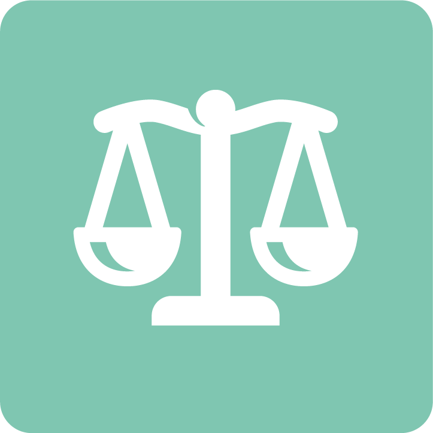

-   ## [Grondrechten](../bouwblokken/fundamentele-rechten/index.md)

    ---

    
    
    ---

    Hulp bij het beschermen van grondrechten en mensenrechten in algoritmes of AI. Bijvoorbeeld het beoordelen van de gevolgen per grondrecht.

    [:octicons-arrow-right-24: Grondrechten](../bouwblokken/fundamentele-rechten/index.md)

-   ## [Publieke inkoop](../bouwblokken/publieke-inkoop/index.md)
    
    ---
  
    
    
    ---

    Hulp bij het publiek inkopen van software met algoritmen en AI. Met hulpmiddelen zoals modelcontracten en de PIANOo-handreiking Inkoop van algoritmes en AI. 

    [:octicons-arrow-right-24: Publieke inkoop](../bouwblokken/publieke-inkoop/index.md)

-   ## [Privacy en gegevens](../bouwblokken/privacy-en-gegevensbescherming/index.md)

    ---

    
    
    ---

    Hulp bij verantwoord gebruik van gegevens voor algoritmes en AI-systemen, zoals persoonsgegevens en privacygevoelige gegevens. 

    [:octicons-arrow-right-24: Naar privacy en gegevensbescherming](../bouwblokken/privacy-en-gegevensbescherming/index.md)

-   ## [Transparantie](../bouwblokken/transparantie/index.md)
    
    ---

    

    ---

    Hulp bij transparant zijn over algoritmes en AI-systemen, zoals gebruikers informeren en publiceren in het algoritmeregister.

    [:octicons-arrow-right-24: Transparantie](../bouwblokken/transparantie/index.md)

-   ## [Bias en non-discriminatie](../bouwblokken/bias-en-non-discriminatie/index.md)
    
    ---

    

    ---

    Hulp bij het voorkomen van bias en discriminatie in algoritmes en AI. Met aanbevelingen en hulpmiddelen zoals het Fairness Handbook.

    [:octicons-arrow-right-24: Bias en non-discriminatie](../bouwblokken/bias-en-non-discriminatie/index.md)

-   ## [Data](../bouwblokken/data/index.md)
    
    ---

    

    ---

    Hulp bij het verantwoord selecteren en verwerken van data voor je algoritmes en AI-systemen. Gebruik bijvoorbeeld de toolbox verantwoord datagebruik.

    [:octicons-arrow-right-24: Naar data](../bouwblokken/data/index.md)

-   ## [Duurzaamheid](../bouwblokken/duurzaamheid/index.md)
    
    ---

    

    ---

    Hulp bij het maken van duurzame keuzes voor hardware en software. Bijvoorbeeld voor de aanschaf van apparaten of het energieverbruik van trainen en data-opslag.

    [:octicons-arrow-right-24: Duurzaamheid](../bouwblokken/duurzaamheid/index.md)

-   ## [Governance](../governance/index.md)
    
    ---

    

    ---

    Hulp bij het verantwoordelijk omgaan met algoritmes en AI-systemen. Bijvoorbeeld het vastleggen van rollen en verantwoordelijkheden.

    [:octicons-arrow-right-24: Governance](../governance/index.md)

-   ## [Menselijke controle](../bouwblokken/menselijke-controle/index.md)
    
    ---

    

    ---

    Hulp bij de controle als mens over algoritmes en AI-systemen. Bijvoorbeeld kunnen ingrijpen bij onbetrouwbare resultaten.

    [:octicons-arrow-right-24: Menselijke controle](../bouwblokken/menselijke-controle/index.md)

-   ## [Technische robuustheid en veiligheid](../bouwblokken/technische-robuustheid-en-veiligheid/index.md)
    
    ---

    

    ---

    Hulp bij het bewaken van de prestaties van algoritmes en AI. En beveiliging van de systemen tegen bijvoorbeeld cyberaanvallen.

    [:octicons-arrow-right-24: Technische robuustheid en veiligheid](../bouwblokken/technische-robuustheid-en-veiligheid/index.md)

!!! Help ons deze pagina te verbeteren

    Deel je idee, suggestie of opmerking via [GitHub](https://github.com/MinBZK/Algoritmekader/edit/main/docs/bouwblokken/index.md) of mail ons via [algoritmes@minbzk.nl](mailto:algoritmes@minbzk.nl).

