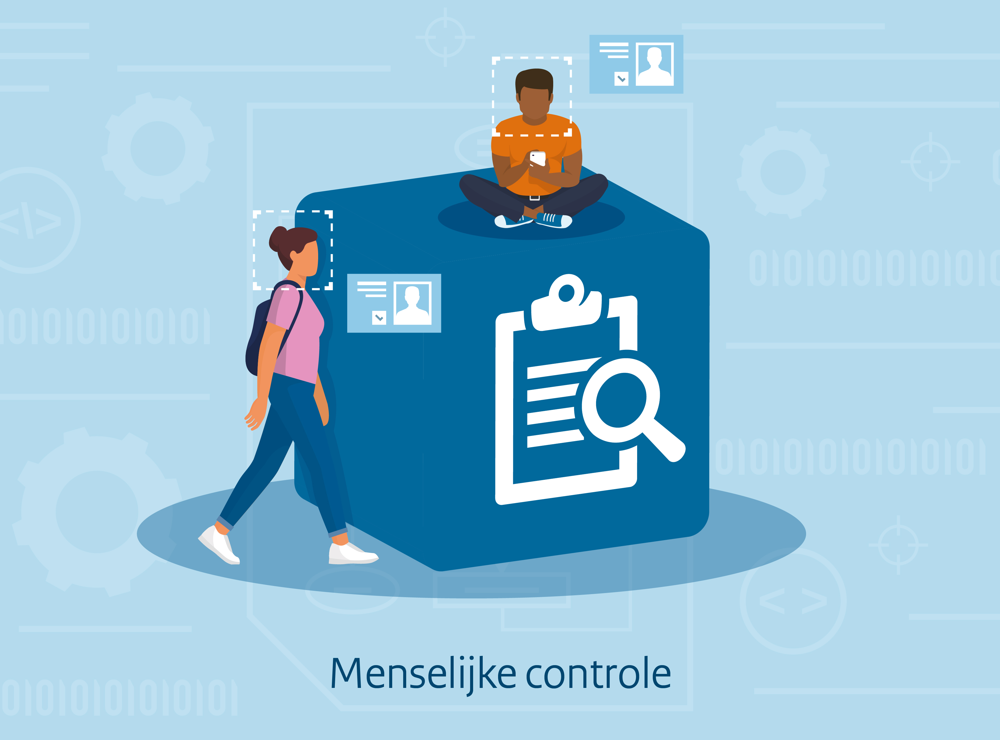

{align="right"; width="50%"}

Bij het uitvoeren van publieke taken is het van belang dat natuurlijke personen kunnen controleren of deze taken correct worden uitgevoerd en dat er kan worden bijgestuurd als dat nodig is. Datzelfde geldt voor als een overheidsinstantie algoritmes of AI-systemen gebruiken bij het ondersteunen van deze taken. Het is van belang dat zowel bij de ontwikkeling en als het gebruik door natuurlijke personen kan worden ingegrepen en dat er sprake is van betekenisvolle menselijke tussenkomst waar dat nodig is. Hier kan worden gedacht aan het verkeerd (gaan) werken van een AI-systeem en dat hierdoor de output onbetrouwbaar en onjuist wordt. In dergelijke gevallen zal een natuurlijk persoon in staat moeten zijn om deze situatie te signaleren en het algoritme of AI-systeem (tijdelijk) te kunnen stoppen.  

Het verschilt, afgewogen tegen de potentiële negatieve gevolgen of risico's voor personen, welke mechanismen moeten worden ingericht in en rondom algoritmes en AI-systemen. Hoog risico AI-systemen zullen een intensiever inrichting van menselijke controle nodig hebben, bijvoorbeeld met meerdere mensen die de output controleren, dan algoritmes die niet impact vol zijn. Om deze controles uit te kunnen voeren zullen deze personen moeten beschikken over de noodzakelijke competenties, opleiding en bevoegdheden om deze taak uit te voeren. Er zullen ook functionele eisen aan het systeem moeten worden gesteld, zodat ook daadwerkelijk kan worden ingegrepen. Hierbij kan worden gedacht aan een stopknop die kan worden gebruikt waarmee die werking van het algoritme of AI-systeem kan worden gepauzeerd. Gedurende de gehele levenscyclus is het van belang dat menselijke controle wordt gepositioneerd en dat bijbehorende taken goed kunnen worden uitgevoerd. 

 
In dit bouwblok van het Algoritmekader wordt uitgewerkt aan welke vereisten moet worden voldaan met betrekking menselijke controle. Dit wordt aangevuld met praktische maatregelen die kunnen worden toegepast ter inspiratie voor organisaties. Deze vereisten en maatregelen worden gekoppeld aan de levenscyclus, zodat zowel bij de ontwikkeling als het gebruik kan worden geraadpleegd hoe organisaties invulling kunnen geven aan menselijk controle.  

## Vereisten

<!-- list_vereisten bouwblok/menselijke-controle -->

## Maatregelen

<!-- list_maatregelen bouwblok/menselijke-controle-->
