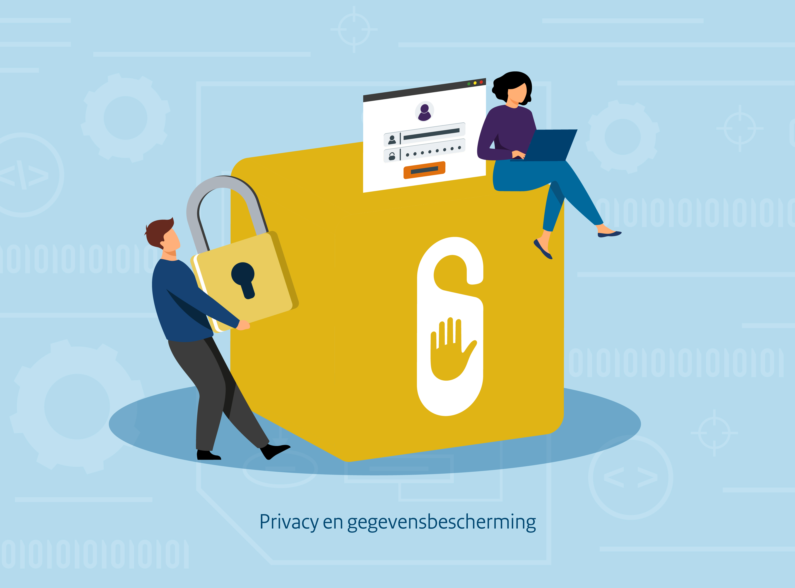

{align="right"; width="50%"}

Overheidsinstanties verwerken vaak persoonsgegevens om hun taken uit te voeren en maatschappelijke waarden te creëren. Met de opkomst van algoritmes en kunstmatige intelligentie (AI) worden deze gegevens steeds vaker gebruikt om processen te optimaliseren, zoals bij het beoordelen van subsidieaanvragen of het verlenen van vergunningen.

Bij het gebruik van algoritmes en AI-systemen is van groot belang om aandacht te besteden aan privacy en gegevensbescherming. Deze technologieën variëren van eenvoudige rekenregels tot complexe machine learning-modellen en generatieve AI, elk met hun eigen specifieke risico’s.
Bijvoorbeeld, eenvoudige AI kan basisberekeningen uitvoeren, terwijl complexere AI-voorspellingen kan doen of informatie kan genereren. Ongeacht de complexiteit is het identificeren van risico’s en het implementeren van passende beheersmaatregelen essentieel om de privacy van burgers te waarborgen en gevoelige gegevens te beschermen.

Bij de inzet van AI in de publieke sector moeten overheidsinstanties rekening houden met de vereisten uit privacywetgeving, zoals de Algemene Verordening Gegevensbescherming (AVG). Dit omvat onder andere het minimaliseren van gegevensgebruik, implementeren van een privacy by design werkwijze waar mogelijk, en het transparant zijn over hoe en waarom (persoons)gegevens worden verwerkt.
Het toewijzen van verantwoordelijkheden en het opstellen van duidelijke richtlijnen voor gegevensverwerking zijn belangrijke stappen in dit proces.

Het bouwblok privacy en gegevensbescherming van algoritmen en AI-systemen wordt ook geïntegreerd in de algoritmelevenscyclus.
Dit biedt inzicht in wanneer specifieke vereisten en maatregelen tijdens de ontwikkeling van algoritmen en AI-systemen moeten worden toegepast.
Door deze vereisten in de levenscyclus te integreren, kunnen de gebruikers inzichten opdoen wanneer deze maatregelen kunnen worden geïmplementeerd.

## Vereisten

<!-- list_vereisten bouwblok/privacy-en-gegevensbescherming -->

## Maatregelen

<!-- list_maatregelen bouwblok/privacy-en-gegevensbescherming-->
