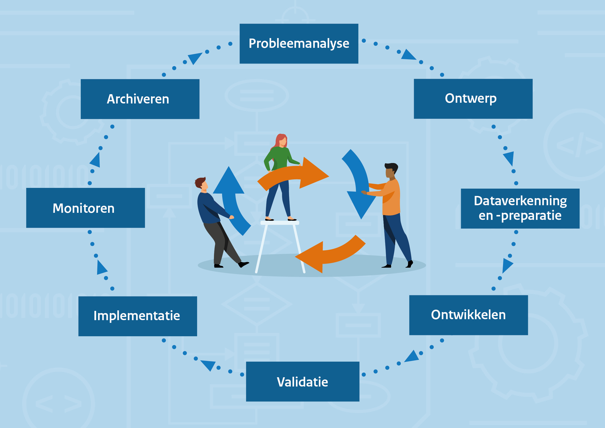

--- 
title: Levenscyclus
icon: material/reload
--- 

!!! info "Disclaimer"

    Het Algoritmekader is nog volop in ontwikkeling. Op deze plek willen we vooral aan de slag gaan op een open en transparante wijze. Het is dus niet definitief. Dat betekent dat er dingen opstaan die niet af zijn en soms zelfs fout. Mocht er iets niet kloppen, laat het ons weten via [GitHub](https://github.com/MinBZK/Algoritmekader).

Algoritmes en AI kunnen door overheidsorganisaties worden gebruikt, bijvoorbeeld bij het leveren van diensten of het nemen van besluiten. 
Algoritmes en AI-systemen doorlopen een zogeheten levenscyclus. 
Een algoritme wordt ontwikkeld, in productie genomen, en na enige tijd van gebruik kan worden besloten het gebruik ervan te beëindigen. 
Omdat de levenscyclus van een algoritme en AI aanzet tot nadenken over de inzet van algoritmes van begin tot eind is het bruikbaar als leidraad om relevante informatie te structureren en te communiceren. 
Wat is het doel, gaat het gebruik ervan wel naar verwachting, wanneer moet wat worden gedaan en wat als het gebruik ten einde loopt? 
In praktijk kan het zo zijn dat de levenscyclus anders verloopt, bijvoorbeeld omdat na validatie en verificatie eerst terug naar de tekentafel moet worden gegaan (ontwerpfase) omdat het nog niet aan de wensen of vereisten voldoet.  

  

## Verschillende versies levenscyclus 
De stappen in de levenscyclus van het Algoritmekader zijn gebaseerd op een samenvoeging van meer dan tien verschillende levenscyclusmodellen. 
Zie [hier](../levenscyclus/Levenscyclus%20vergelijkingstabel.pdf) een overzicht. 
Afhankelijk van hoe een organisatie het ontwikkelproces inricht, kan een levenscyclusmodel er net weer anders uitzien. 
De huidige indeling is gekozen omdat deze het beste aansluit bij bestaande levenscyclusmodellen en bij de behoeftes en werkwijze van overheidsinstanties. 

## Doorlopend verantwoord 

Om tot een wettige, ethisch verantwoorde en robuuste inzet van algoritmes en AI te komen zullen in elke fase van de levenscyclus specifieke handelingen of maatregelen moeten worden getroffen. 
In het Algoritmekader worden vereisten en maatregelen gekoppeld aan de levenscyclus.
De meeste vereisten waar algoritmen en AI aan moeten voldoen zullen in meerdere fasen van levenscyclus relevant zijn. 
Zo zijn transparantie, veiligheid, privacy, risicomanagement, en de afweging van ethische aspecten belangrijk in iedere fase van de levenscyclus. 
Maatregelen bij de vereisten kunnen fijnmaziger worden gekoppeld aan verschillende fases van de levenscyclus, hoewel bepaalde maatregelen ook terugkerend zullen zijn en voortdurend aandacht moeten krijgen. 
Naast een beschrijving van de betreffende fase, wordt weergeven welke vereisten en maatregelen relevant kunnen zijn binnen deze fase.  