# Levenscyclus van een algoritme

Om algoritmes op een verantwoorde manier te gebruiken, zul je op de juiste momenten aandacht moeten hebben voor de juiste onderwerpen en risico's. 
Van het ontwikkelen van een oplossing, tot het in gebruik nemen van die oplossing en er uiteindelijk weer mee stoppen.
Door al in een vroeg stadium aandacht besteden aan bijvoorbeeld een eventuele inbreuk op mensenrechten kan je hier gedurende het hele proces al rekening mee houden. 

De levenscyclus helpt je om te bepalen wat je wanneer moet doen.

/// html | div[style='float: left; width: 50%;']

## Fases van de levenscyclus

<ol start="0">
  <li> <a href="organisatieverantwoordelijkheden/">Organisatieverantwoordelijkheden</a></li>
  <li> <a href="probleemanalyse/">Probleemanalyse</a></li>
  <li> <a href="ontwerp/">Ontwerp</a></li>
  <li> <a href="dataverkenning-en-datapreparatie/">Dataverkenning en datapreparatie</a></li>
  <li> <a href="ontwikkelen/">Ontwikkelen</a></li>
  <li> <a href="verificatie-en-validatie/">Verificatie en validatie</a></li>
  <li> <a href="implementatie/">Implementeren</a></li>
  <li> <a href="monitoring-en-beheer/">Monitoring en beheer</a></li>
  <li> <a href="uitfaseren/">Uitfaseren</a></li>
</ol>

## Systeemniveau en organisatieniveau
De levenscyclus kent twee verschillende niveau's: 

- **organisatieniveau**: Sommige vereisten zijn algemeen en vragen om een organisatiebrede aanpak. Dit gaat bijvoorbeeld om passende processen en risicomanagment in je organisatie. Of het creëeren van bewustzijn en kennis binnen je organisatie. In het ideale geval besteed je hier al aandacht aan voordat je begint met de ontwikkeling of het gebruik van algoritmes. Bij deze fase horen maatregelen die je niet voor ieder systeem opnieuw zal hoeven te bekijken.
- **systeemniveau**: Sommige vereisten voor verantwoorde inzet van algoritmes zul je bij ieder algoritme weer opnieuw aandacht moeten geven. Dat geldt bijvoorbeeld voor het beschermen van grondrechten. 

///

/// html | div[style='float: right;width: 50%;']

```mermaid

  flowchart TD
      subgraph organisatieniveau [organisatieniveau &nbsp&nbsp&nbsp&nbsp&nbsp&nbsp&nbsp&nbsp&nbsp&nbsp&nbsp&nbsp&nbsp&nbsp&nbsp&nbsp&nbsp&nbsp&nbsp&nbsp&nbsp&nbsp&nbsp&nbsp&nbsp&nbsp&nbsp&nbsp&nbsp&nbsp&nbsp&nbsp&nbsp&nbsp&nbsp&nbsp&nbsp&nbsp&nbsp&nbsp&nbsp&nbsp&nbsp&nbsp&nbsp&nbsp&nbsp&nbsp&nbsp&nbsp&nbsp&nbsp&nbsp&nbsp&nbsp&nbsp&nbsp&nbsp&nbsp&nbsp&nbsp&nbsp&nbsp&nbsp&nbsp&nbsp&nbsp&nbsp&nbsp&nbsp&nbsp&nbsp&nbsp&nbsp]
        0(0. Organisatieverantwoordelijkheden) --> 1(1. Probleemanalyse);
        subgraph systeemniveau [systeemniveau &nbsp&nbsp&nbsp&nbsp&nbsp&nbsp&nbsp&nbsp&nbsp&nbsp&nbsp&nbsp&nbsp&nbsp&nbsp&nbsp&nbsp&nbsp&nbsp&nbsp&nbsp&nbsp&nbsp&nbsp&nbsp&nbsp&nbsp&nbsp&nbsp&nbsp&nbsp&nbsp&nbsp&nbsp&nbsp&nbsp&nbsp&nbsp&nbsp&nbsp&nbsp&nbsp&nbsp&nbsp&nbsp&nbsp&nbsp&nbsp&nbsp&nbsp&nbsp&nbsp&nbsp&nbsp&nbsp&nbsp&nbsp&nbsp&nbsp&nbsp&nbsp&nbsp&nbsp&nbsp&nbsp&nbsp&nbsp&nbsp]
          7(7. Monitoring en beheer) --> 1(1. Probleemanalyse);
          1(1. Probleemanalyse) --> 2(2. Ontwerp);
          2(2. Ontwerp) --> 3(3. Dataverkenning en datapreparatie);
          3(3. Dataverkenning en datapreparatie) --> 4(4. Ontwikkelen);
          4(4. Ontwikkelen) --> 5(5. Verificatie en validatie);
          5(5. Verificatie en validatie) --> 6(6. Implementatie);
          6(6. Implementatie) --> 7(7. Monitoring en beheer);
          7(7. Monitoring en beheer) -.-> 8(8. Uitfaseren);
        end
      end

      click 0 href "organisatieverantwoordelijkheden"
      click 1 href "probleemanalyse"
      click 2 href "ontwerp"
      click 3 href "dataverkenning-en-datapreparatie"
      click 4 href "ontwikkelen"
      click 5 href "verificatie-en-validatie"
      click 6 href "implementatie"
      click 7 href "monitoring-en-beheer"
      click 8 href "uitfaseren"

      style 0 color:#fff, fill:#1975d2, stroke:#1975d2, text-decoration:underline;
      style 1 color:#fff, fill:#1975d2, stroke:#1975d2, text-decoration:underline;
      style 2 color:#fff, fill:#1975d2, stroke:#1975d2, text-decoration:underline;
      style 3 color:#fff, fill:#1975d2, stroke:#1975d2, text-decoration:underline;
      style 4 color:#fff, fill:#1975d2, stroke:#1975d2, text-decoration:underline;
      style 5 color:#fff, fill:#1975d2, stroke:#1975d2, text-decoration:underline;
      style 6 color:#fff, fill:#1975d2, stroke:#1975d2, text-decoration:underline;
      style 7 color:#fff, fill:#1975d2, stroke:#1975d2, text-decoration:underline;
      style 8 color:#fff, fill:#1975d2, stroke:#1975d2, text-decoration:underline;

      style organisatieniveau fill:transparant

```

///

/// html | div[style='clear: both;']
///

!!! tip "Tip"

    In de praktijk herhaal je soms fases of ga je terug naar een eerdere fase. Mislukt bijvoorbeeld het valideren (fase 5), dan moet je terug naar de ontwerpfase (fase 2) omdat het product nog niet voldoet aan de wensen of vereisten.

## Andere levenscyclusmodellen

De 9 fasen van de levenscyclus zijn gebaseerd op 10 belangrijke levenscyclusmodellen voor het ontwikkelen van AI, zoals:

- CRISP-DM (cross-industry standard process for data mining)
- ASUM-DM (analytics solutions unified method)
- SEMMA (Sample, Explore, Modify, Model, and Assess)
- Microsoft TDSP (Team Data Science Process)
- MDLM (mobile device lifecycle management)
- NIST (National Institute of Standards and Technology)
- ISO/IEC 22989

Deze 9 fasen passen zo goed mogelijk bij de manier van werken van overheden.
Het is geen verplicht model. Mogelijk past een ander levenscyclusmodel beter bij jouw organisatie.
