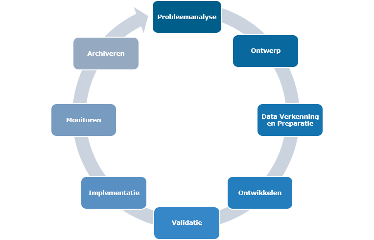

# Levenscyclus

!!! info "Disclaimer"

    Het Algoritmekader is nog volop in ontwikkeling. Op deze plek willen we vooral aan de slag gaan op een open en transparante wijze. Het is dus niet definitief. Dat betekent dat er dingen opstaan die niet af zijn en soms zelfs fout. Mocht er iets niet kloppen, laat het ons weten via [GitHub](https://github.com/MinBZK/Algoritmekader).

Algoritmen en kunstmatige intelligentie zijn ‘producten’ die door overheidsinstellingen kunnen worden gebruikt om de uitvoering van wettelijke taken te ondersteunen. Deze producten doorlopen een zogenaamde levenscyclus. Een algoritme wordt ontwikkeld en na enige tijd van gebruik kan worden besloten het gebruik ervan te beëindigen. Omdat de ‘algoritme levenscyclus’ voor alle gevallen nagenoeg hetzelfde is het bruikbaar als leidraad om relevante informatie te structureren en te communiceren.

### Verschillende versies levenscyclus
De stappen in de levenscyclus van het algoritmekader zijn gebaseerd op een samenvoeging van meer dan tien verschillende levenscyclusmodellen. Zie [hier](https://github.com/MinBZK/Algoritmekader/blob/main/docs/levenscyclus/Levenscyclus%20vergelijkingstabel.pdf) een overzicht. Afhankelijk van hoe een organisatie het ontwikkelproces van AI inricht kan een levenscyclus model er net weer anders uitzien (als AI-ontwikkelaar verwacht je waarschijnlijk wat kleinere cycli in de grotere lifecycle te zien). De huidige opdeling is gekozen omdat deze het beste aansluit bij bestaande levenscyclusmodellen en bij de behoeftes en werkwijze van overheidsinstanties.

### Fundamentele principes
Om tot een wettige, ethisch verantwoorde en robuuste oplossing te komen zullen in elke fase van de algoritme levenscyclus specifieke handelingen of maatregelen moeten worden getroffen. Transparantie, veiligheid, privacy, risicomanagement, governance, en afweging van ethische aspecten zijn relevant in iedere stap van de levenscyclus. Om concreet te maken wat er dan moet gebeuren, kan het erg helpen om per stap in de levenscyclus helpen om te weten wát er dan precies kan gebeuren. 

  
