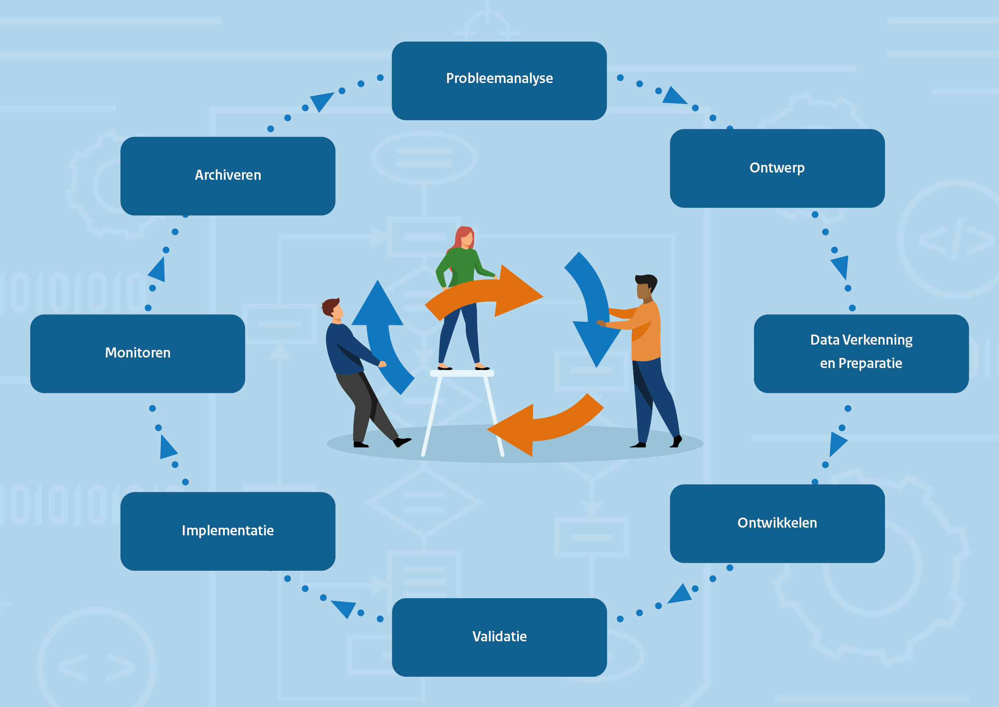

# Levenscyclus

!!! info "Disclaimer"

    Het Algoritmekader is nog volop in ontwikkeling. Op deze plek willen we vooral aan de slag gaan op een open en transparante wijze. Het is dus niet definitief. Dat betekent dat er dingen opstaan die niet af zijn en soms zelfs fout. Mocht er iets niet kloppen, laat het ons weten via [GitHub](https://github.com/MinBZK/Algoritmekader).

Algoritmen en kunstmatige intelligentie zijn ‘producten’ die door overheidsinstellingen kunnen worden gebruikt om de uitvoering van wettelijke taken te ondersteunen. Deze producten doorlopen een zogenaamde levenscyclus. Een algoritme wordt ontwikkeld en na enige tijd van gebruik kan worden besloten het gebruik ervan te beëindigen. Een krachtig aspect van de ‘algoritme levenscyclus’ is dat de levenscyclus voor alle gevallen nagenoeg hetzelfde is. Daarmee is het bruikbaar als leidraad om relevante informatie te structureren en  te communiceren. Het is tegelijkertijd een brug tussen de technische kant van het product en de wereld van gebruikers. Om tot een wettige, ethisch verantwoorde en robuuste oplossing te komen zullen in elke fase van de algoritme levenscyclus specifieke handelingen of maatregelen moeten worden getroffen.  

  
