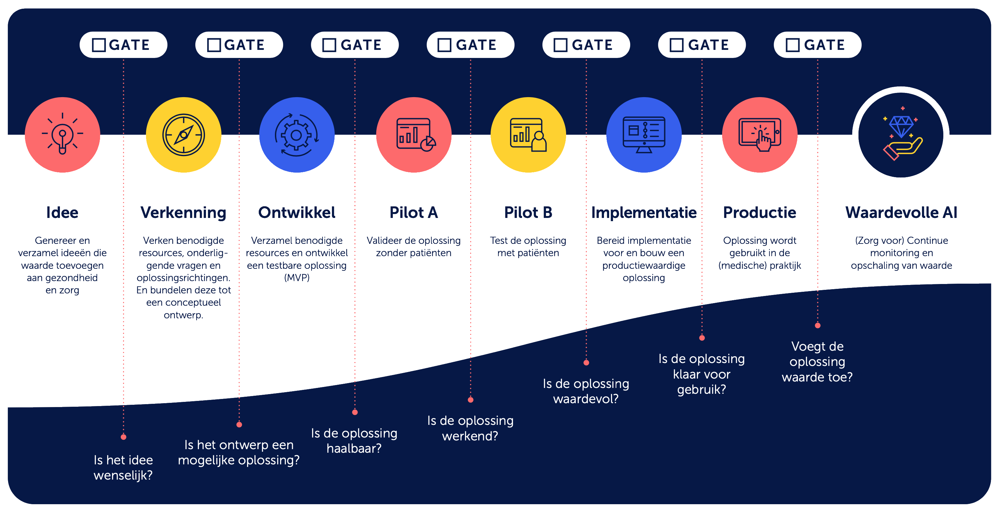

<!-- tags -->

## Maatregel

Bepaal wie wanneer betrokken moet zijn in de algoritmelevenscyclus en maak gebruik van beslismomenten in de levenscyclus van een algoritme.

## Toelichting
- Om algoritmes op een verantwoorde manier te gebruiken, zul je op de juiste momenten aandacht moeten hebben voor de juiste onderwerpen en risico's. Dit zich steeds herhalende proces van ontwerpen, ontwikkelen en in gebruik nemen noemen we de [levenscyclus](../levenscyclus/index.md). 
- Voor effectieve governance van algoritmes is het essentieel om bij de ontwikkeling en gebruik hiervan heldere afspraken te hebben over de interactie en informatie-uitwisseling die vereist is om aan de verantwoording te voldoen.
- Per fase in de levenscyclus kan het zijn dat andere expertise moet worden betrokken. Leg vast wie er wanneer betrokken moet worden in de algoritmelevenscyclus.
- In het Algoritmekader zijn de maatregelen hoogover gekoppeld aan verschillende rollen. Dat geeft houvast om te kunnen bepalen welke rollen binnen de eigen organisatie moeten ingezet.

- Algoritmegovernance kan op de levenscyclus aansluiten door 'gates' of controlepunten in te voeren. Deze gates bevatten belangrijke mijlpalen om te beoordelen of de juiste taken zijn uitgevoerd, of ethische afwegingen zijn geamaakt, of documentatie heeft plaatsgevonden en of akkoord is ingewonnen (go/no-go moment) bij de verantwoordelijke(n) om naar de volgende fase te mogen. 
- Het is belangrijk om te weten dat toepassing van deze ‘gates’ niet altijd hetzelfde is. Dit kan verschillen afhankelijk van het type algoritme. 
- Een hoog-risico-AI-systeem moet aan meer vereisten voldoen dan een niet impactvol algoritme. Een hoog-risico AI-systeem moet daarom binnen de gates worden getoetst op meer onderdelen dan een niet impactvol algoritme.

## Bronnen
- Hulpmiddel handelingsruimte waardevolle AI in de zorg ([presentatie](https://nlaic.com/wp-content/uploads/2022/06/04a.-Hulpmiddel-Handelingsruimte-Waardevolle-AI-voor-gezondheid-en-zorg.pdf))([samenvatting](https://nlaic.com/wp-content/uploads/2022/08/NLAIC_AI-Lifecycle-management-in-de-zorg-samenvatting_V1.2.pdf)) is beschikbaar via de [NL AI Coalitie](https://nlaic.com/toepassingsgebied/gezondheid-en-zorg/) en [Data voor gezondheid](https://www.datavoorgezondheid.nl/wegwijzer-ai-in-de-zorg/documenten/publicaties/2021/07/15/hulpmiddel-handelingsruimte-waardevolle-ai-voor-gezondheid)
- UWV Beleidsdocument model risico management, Modellevenscyclus (blz 21), 29 september 2021
- Lifecyclemanagement in het [toetsingskader](https://www.rekenkamer.nl/onderwerpen/algoritmes/documenten/publicaties/2024/05/15/het-toetsingskader-aan-de-slag) van de Algemene Rekenkamer nr (1.07) .

## Bijbehorende vereiste(n)
<!-- Hier volgt een lijst met vereisten op basis van de in de metadata ingevulde vereiste -->

<!-- Let op! onderstaande regel met 'list_vereisten_on_maatregelen_page' niet weghalen! Deze maakt automatisch een lijst van bijbehorende verseisten op basis van de metadata  -->
<!-- list_vereisten_on_maatregelen_page -->

## Risico 
<!-- vul hier het specifieke risico in dat kan worden gemitigeerd met behulp van deze maatregel -->

## Voorbeelden

Hieronder volgen twee voorbeelden van hoe governance effectief kan worden geïntegreerd in de levenscyclus van algoritmen en AI-modellen:

!!! example "Ministerie VWS In de levenscyclus"

    In het [hulpmiddel handelingsruimte waardevolle AI in de zorg](https://nlaic.com/wp-content/uploads/2022/06/04a.-Hulpmiddel-Handelingsruimte-Waardevolle-AI-voor-gezondheid-en-zorg.pdf#page=3) is tussen elke fase in de levenscyclus een ‘gate’ geplaatst. Tussen de afronding van een fase en de start van de daaropvolgende fase wordt een formele poort geplaatst. Om door deze poort te gaan, moet de voorgaande fase volledig zijn afgerond: vraagstukken dienen beantwoord te zijn, activiteiten uitgevoerd en aan interne en externe vereisten dient te zijn voldaan. Deze zaken kunnen in de vorm van documentatie aan de organisatie worden opgeleverd, waarna een gesprek of review kan plaatsvinden.

    Het vormgeven van deze overgangen geeft verantwoordelijke stakeholders binnen de organisatie een structuur om de ontwikkeling en inzet van algoritmen in elke fase te beoordelen en bij te sturen. De gezamenlijke kernvraag voor alle betrokkenen in de gates is: Geloven we dat de voordelen van de inzet (en ontwikkeling) van dit algoritme opwegen tegen eventueel te verwachten nadelen? En hoe gaan we om met deze dilemma's? Daarbij kunnen opvolgende fasen in de levenscyclus een eigen accentvraag kennen, zoals “Is het beoogde algoritme wenselijk?” in de probleemanalyse fase tot “Levert het algoritme nog de waarde op die we beogen?” tijdens de monitoring- en beheerfase.

    

!!! example "Voorbeeld: Het UWV" 

    In haar modellevenscyclus [^3] maakt het UWV gebruik van een gelaagdheid in de “gates” door gebruik te maken van een zachte en harde knip tussen de opvolgende fasen. Enerzijds is er een zachte knip voorzien door aan het eind van elke fase de mogelijkheid te laten om een stap terug te zetten in de levenscyclus. Mocht het onduidelijk zijn wat de beoogde voordelen zijn ten opzichte van de nadelen, of er onvoldoende invulling gegeven is aan de vereisten/activiteiten, dan kan het algoritme of AI-model ontwikkelproces bij een zachte knip een stap terugnemen in de levenscyclus. Anderzijds zijn er 4 harde grenzen in de levenscyclus aangebracht waarin formele vereisten aan het ontwikkeltraject worden opgelegd.

    

!!! example "Voorbeeld: BD (Analytische en Cognitieve Technologie - CoE Cognitieve Oplossingen)"

    Enkele ervaringen m.b.t. levencyclus:
    Plot sleutelmomenten en mijlpaal momenen in die nodig zijn om het proces te kunnen laten werken en bepaal de requirements die daarmee samenhangen.
    Richt als eerste een basis (b.v. voor low risk) de AI-governance in op operationeel niveau, implementeer deze basis en stel gaandeweg/ondertussen op basis van o.a. best practices de requirements op naar de "wereld" er om heen (tactisch en strategisch niveau). 

    

!!! example "Voorbeeld: Algoritmeprocesmodel Ministerie van Defensie"

    Het Ministerie van Defensie heeft een "algoritmeprocesmodel" ontwikkeld. Op level 1 is het een levenscyclus zoals ook in het Algoritmekader. Op level 2  wordt ingegaan op de rollen en verantwoordelijkheden. Op level 3 zijn ook formulieren om op specifieke momenten in de AI-levenscyclus de juiste documentatie op te leveren. N.B.: Defensie heeft dit ingericht in Sharepoint, waardoor verantwoordelijken te koppelen zijn aan activiteiten in de levenscyclus.

    

