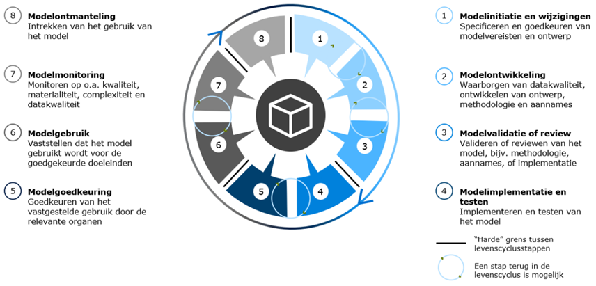

<!-- tags -->

## Maatregel

Richt in hoe binnen de AI-levenscyclus rollen en verantwoordelijkheden worden ingericht. 
Let hierbij op _gates_: momenten waarop er een go/no-go kan worden gegeven.

Om algoritmes op een verantwoorde manier te gebruiken, zul je op de juiste momenten aandacht moeten hebben voor de juiste onderwerpen en risico's. Dit zich steeds herhalende proces van ontwerpen, ontwikkelen en in gebruik nemen noemen we de [levenscyclus](https://minbzk.github.io/Algoritmekader/levenscyclus/). 

Voor effectieve governance van algoritmen en AI is het essentieel om bij de ontwikkeling en gebruik hiervan heldere afspraken te hebben over de interactie en informatie-uitwisseling die vereist is om aan de verantwoording te voldoen. 
Dit moet gebeuren in iedere fase van de levenscyclus, tussen de direct betrokkenen en de stakeholders binnen en buiten de organisatie. 
Per fase in de levenscyclus zijn dus andere [rollen en verantwoordelijkheden](rollen-en-verantwoordelijkheden.md) aan zet. 

Veel organisaties hebben al een levenscyclus voor AI-ontwikkeling, voortbouwend op IT-ontwikkeling. 
Let op dat er vaak kleine verschillen zitten in de stappen van een lifecycle model.
AI-governance kan op de levenscyclus aansluiten door 'gates' of controlepunten in te voeren tussen de verschillende stappen in de levenscyclus waar bepaalde processen worden uitgevoerd door verantwoordelijken, zoals het aanleveren van documenten, het uitvoeren van controles en het maken van afwegingen. 

Het is belangrijk om te weten dat deze ‘gates’ niet altijd hetzelfde zijn voor verschillende projecten. 
Een algoritme met een hoog risico heeft bijvoorbeeld andere regels nodig dan minder belangrijke algoritmes. 
Ook vraagt het kopen van een kant-en-klaar AI-systeem of SaaS om andere procedures dan het kopen van software die nog verder ontwikkeld moet worden.

Hieronder volgen twee voorbeelden van hoe governance effectief kan worden geïntegreerd in de levenscyclus van algoritmen en AI-modellen:

!!! example "Ministerie VWS In de levenscyclus"

    In het [hulpmiddel handelingsruimte waardevolle AI in de zorg](https://nlaic.com/wp-content/uploads/2022/06/04a.-Hulpmiddel-Handelingsruimte-Waardevolle-AI-voor-gezondheid-en-zorg.pdf#page=3) is tussen elke fase in de levenscyclus een ‘gate’ geplaatst. Tussen de afronding van een fase en de start van de daaropvolgende fase wordt een formele poort geplaatst. Om door deze poort te gaan, moet de voorgaande fase volledig zijn afgerond: vraagstukken dienen beantwoord te zijn, activiteiten uitgevoerd en aan interne en externe vereisten dient te zijn voldaan. Deze zaken kunnen in de vorm van documentatie aan de organisatie worden opgeleverd, waarna een gesprek of review kan plaatsvinden.

    Het vormgeven van deze overgangen geeft verantwoordelijke stakeholders binnen de organisatie een structuur om de ontwikkeling en inzet van algoritmen en AI in elke fase te beoordelen en bij te sturen. De gezamenlijke kernvraag voor alle betrokkenen in de gates is: Geloven we dat de voordelen van de inzet (en ontwikkeling) van dit algoritme of AI-model opwegen tegen eventueel te verwachten nadelen? En hoe gaan we om met deze dilemma's? Daarbij kunnen opvolgende fasen in de levenscyclus een eigen accentvraag kennen, zoals “Is het beoogde algoritme wenselijk?” in de probleemanalyse fase tot “Levert het algoritme nog de waarde op die we beogen?” tijdens de monitoring- en beheerfase.

    

!!! example "Voorbeeld: Het UWV" 

    In haar modellevenscyclus [^3] maakt het UWV gebruik van een gelaagdheid in de “gates” door gebruik te maken van een zachte en harde knip tussen de opvolgende fasen. Enerzijds is er een zachte knip voorzien door aan het eind van elke fase de mogelijkheid te laten om een stap terug te zetten in de levenscyclus. Mocht het onduidelijk zijn wat de beoogde voordelen zijn ten opzichte van de nadelen, of er onvoldoende invulling gegeven is aan de vereisten/activiteiten, dan kan het algoritme of AI-model ontwikkelproces bij een zachte knip een stap terugnemen in de levenscyclus. Anderzijds zijn er 4 harde grenzen in de levenscyclus aangebracht waarin formele vereisten aan het ontwikkeltraject worden opgelegd.

    
 
#### Aandachts- en actiepunten
* Introduceer ‘gates’ tussen fases in de AI-levenscyclus; voor de cyclus verder kan gaan moeten handelingen worden uitgevoerd door verantwoordelijken zoals: documenten aanleveren, (ethische) afwegingen, rapportages.
* De levenscyclus bij inkoop is waarschijnlijk anders, maar heeft ook 'gates' en procedures nodig.
* Er bestaan veel varianten van AI-levenscycli. Kijk goed wat past bij de (bestaande) processen van jouw organisatie. 

 
## Bronnen

- Hulpmiddel handelingsruimte waardevolle AI in de zorg ([presentatie](https://nlaic.com/wp-content/uploads/2022/06/04a.-Hulpmiddel-Handelingsruimte-Waardevolle-AI-voor-gezondheid-en-zorg.pdf))([samenvatting](https://nlaic.com/wp-content/uploads/2022/08/NLAIC_AI-Lifecycle-management-in-de-zorg-samenvatting_V1.2.pdf)) is beschikbaar via de [NL AI Coalitie](https://nlaic.com/toepassingsgebied/gezondheid-en-zorg/) en [Data voor gezondheid](https://www.datavoorgezondheid.nl/wegwijzer-ai-in-de-zorg/documenten/publicaties/2021/07/15/hulpmiddel-handelingsruimte-waardevolle-ai-voor-gezondheid)

- UWV Beleidsdocument model risico management, Modellevenscyclus (blz 21), 29 september 2021

## Bijbehorende vereiste(n)

<!-- list_vereisten_on_maatregelen_page -->

