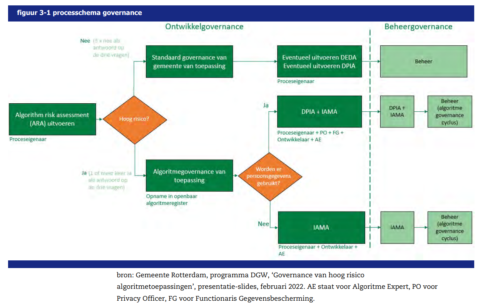

## Maatregel
Er is verschil in de vereisten en maatregelen die nodig zijn afhankelijk van het type risico en impact. 
Zo vraagt bijvoorbeeld de AI-verordening om meer vereisten bij hoog-risico AI-systemen zijn. 
Een meer uitgebreide governance is daar nodig, in de zin dat er meer handelingen en verslagleggingen nodig zijn.
Een ander voorbeeld is dat voor generatieve AI (AI voor algemene doeleinden in de AI-verordening) er meer vereisten zijn.

Afgeleid van de term "minimum viable product" wordt de processen van compliance doen aansluiten op wat nodig is ook wel "minimum viable compliance" genoemd.

## Aandachts- en actiepunten
* Richt formulieren of procedures zo in dat je niet onnodige stappen hoeft te doorlopen als je vroegtijdig kan vaststellen dat niet alle vereisten gelden.
* Let wel op dat je niet enkel kijkt naar "hoog-risico" volgens de AI-verordening. Ook AI-systemen die niet "hoog-risico" AI-verorderning zijn, kunnen grote impact hebben op burgers!

## Voorbeelden

De gemeente Rotterdam kiest ervoor om de algoritme en AI governance alleen in te zetten bij hoog-risico AI-toepassingen. 
Deze risicoclassificatie volgt de AI verordening Voor laag-risico toepassingen geldt de standaard governance van de gemeente: de informatiebeveiligings- en privacy governance (Kleur Bekennen, Rekenkamer Rotterdam, 2024, p.71). Tabel 1 geeft inzicht in verschillende typen algoritmen en AI-toepassingen. De afbeelding uit hetzelfde rapport geeft een flowchart van hoe de governance anders is afhankelijk van de risico-categorie. 

Er is daarnaast ook het principe gehanteerd dat naast hoog-risico volgens de AI-verordening, bij ieder algoritme aan de hand van een drietal vragen moet worden besloten of een uitgebreidere  algoritmegovernance nodig is.
* Is de werking van het algoritme niet volledig én beknopt uit te leggen aan een gemiddelde Rotterdammer?
* Ontbreekt er een menselijke beoordeling voordat de uitkomst van het algoritme in de praktijk wordt gebracht door middel van een concrete handeling van de gemeente?
* Is het voorstelbaar dat de algoritmetoepassing uitmondt in een onrechtvaardige handeling van de gemeente tegen burgers of bedrijven

Kijk zelf goed wat passend is voor jouw organisatie. 

#### Iteratief te werk gaan
* Is algoritmegovernance nieuw bij jouw organisatie, dan kan het helpen om een use case met beperkt risico te doorlopen om hiervan te leren.

Voorbeeld BD (Analytische en Cognitieve Technologie | CoE Cognitieve Oplossingen):
* Richt als eerste een basis (b.v. voor low risk) de AI-governance in op operationeel niveau, implementeer deze basis en stel gaandeweg/ondertussen op basis van o.a. best practices de requirements op naar de "wereld" er om heen (tactisch en strategisch niveau). 

## Bijbehorende vereiste(n)

<!-- list_vereisten_on_maatregelen_page -->
