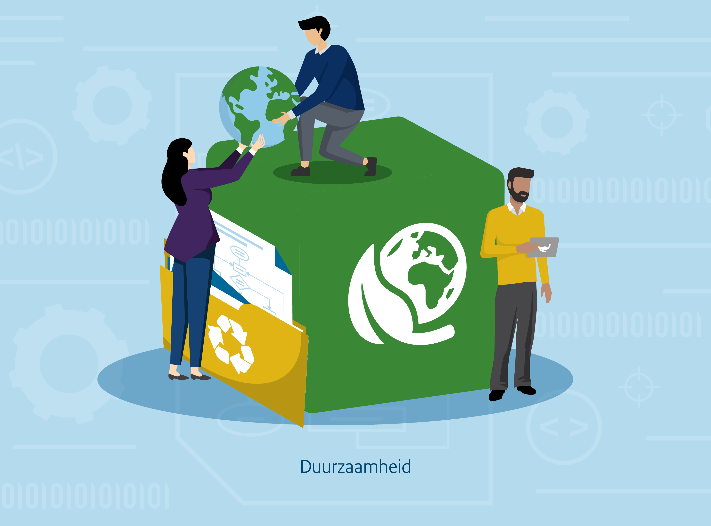

{align="right"; width="50%"}

Onze impact op natuur en milieu is groot. 
Er zijn grote doelen gesteld om duurzamer te gaan leven en werken. Binnen alle overheidsorganisaties, op allerlei verschillende gebieden, wordt gekeken hoe er duurzamer te werk kan worden gegaan, dus ook bij ICT-voorzieningen. 

Bij het duurzamer maken van ICT kan gedacht worden aan de fysieke kant (hardware) en de digitale kant (software, algoritmes).
Met betrekking tot hardware kan men bijvoorbeeld zo duurzaam mogelijk hardware inkopen (circulariteit van apparaten en materialen) en proberen de levensduur van apparaten en onderdelen te maximaliseren. Bij ontwikkeling en inzet van software, zoals algoritmen, zal gekeken moeten worden naar andere zaken, zoals energieverbruik van het trainen van complexe modellen.
In het Algoritmekader gaan we specifiek in op deze duurzaamheidsaspecten van algoritmes en AI-systemen. 

## Duurzaamheid algoritmes en AI-systemen 
Het concept duurzaamheid is een groot en generiek begrip, dat vele sub-thema’s introduceert. 
Deze thema’s raken onder andere het ontwerp, de ontwikkeling en de inzet van algoritmes en AI-systemen. 
Met de opkomst van grotere en ingewikkeldere modellen, grotere datasets, en de groeiende interesse in (generatieve) AI, groeit ook het energie- en waterverbruik.
Dit verbruik ontstaat ook bij het trainen van grotere en complexere rekenmodellen zoals Large Language Models, en de opslag van zeer grote (vaak multimediale) datasets in datacenter. 

Dit bouwblok van het Algoritmekader biedt een gestructureerd overzicht van vereisten, maatregelen en hulpmiddelen die ondersteunen bij het ontwikkelen en toepassen van algoritmes en AI-systemen op een duurzame wijze.
Zo kunnen bewuste keuzes worden gemaakt die niet alleen voldoen aan de functionaliteiten, maar ook bijdragen aan de Sustainable Development Goals (SDG's) en de doelstellingen uit het [Nederlandse klimaatakkoord](https://www.rijksoverheid.nl/onderwerpen/klimaatverandering/klimaatakkoord/wat-is-het-klimaatakkoord).
Bij duurzame ontwikkeling en toepassing van algoritmes kan bijvoorbeeld gedacht worden aan energie-efficiënte programmering en duurzaam datacenterbeheer. 

!!! info "Opmerking"

    Dit bouwblok moet nog ontwikkeld worden. Deze pagina is dus nog niet volledig. Op deze pagina vindt je mogelijk wel al onderdelen waar we aandacht aan willen besteden in dit bouwblok. 

## Vereisten

<!-- list_vereisten onderwerp/duurzaamheid no-search no-onderwerp no-rol no-levenscyclus -->

## Maatregelen

<!-- list_maatregelen onderwerp/duurzaamheid no-search no-onderwerp no-rol no-levenscyclus -->
