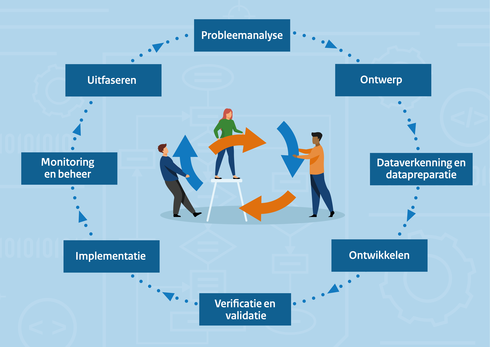

Het is van belang dat algoritmes en AI op een verantwoorde manier worden ontwikkeld en gebruikt. 
Dit betekent dat er aandacht moet zijn voor zaken als:

1. rollen en verantwoordelijkheden (governance);
2. risico’s op bias/discriminatie vroegtijdig detecteren;
3. de uitvoering van mensenrechtentoetsen (zoals IAMA’s);
4. adequate inkoopvoorwaarden afspreken voor algoritmes die de overheid inkoopt bij derden. 

Maar hoe doe je dat dan? Hier helpt het Algoritmekader je bij: een interactieve kennisbank waarin je kunt zoeken naar informatie op basis van een onderwerp, een fase uit de levenscyclus of jouw rol.  

### Levenscyclus van een algoritme, vereisten, maatregelen en rollen

{align="right"; width="60%"}

Het Algoritmekader maakt inzichtelijk aan welke vereisten overheidsorganisaties moeten voldoen. 
Daarbij wordt ook aangegeven hoe zij hier op een betekenisvolle wijze invulling aan kunnen geven (maatregelen).
Het Algoritmekader is zo ingericht dat gebruikers vanuit verschillende invalshoeken informatie kunnen raadplegen die voor hen relevant is. 
Zo kun je vanuit de levenscyclus van een algoritme onderzoeken in welke fase, aan welke vereisten en maatregelen je aandacht moet besteden. 
Het is ook mogelijk om vanuit een specifieke rol, bijvoorbeeld een ethicus of data scientist, te raadplegen bij welke vereisten of maatregelen je logischerwijs betrokken moet zijn.  

### Type technologie en risicoclassificatie
Het Algoritmekader geeft gebruikers de mogelijkheid om informatie te 'filteren'. 

Dit kun je bijvoorbeeld doen op basis van type technologie en risico classificatie. 
Zo kunnen gebruikers snel zien wat zij in een bepaalde situatie moeten doen. 
In het geval van een hoog risico AI-systeem waarbij persoonsgegevens worden verwerkt moet je aan meer vereisten voldoen dan dan bij een eenvoudige rekenregel die geen impact heeft op individuen of de maatschappij. 
Deze inzichten helpen overheidsorganisaties om effectief en gericht hun middelen in te zetten.  

!!! note "Opmerking"
    Aan deze functionaliteit wordt nog gewerkt. Meer hierover zal volgen in een volgende versie. 

### Standaarden
Een belangrijk uitgangspunt van het Algoritmekader is dat bestaande kennis zoveel mogelijk wordt gebundeld en aansluiting wordt gezocht bij relevante ontwikkelingen. 
Het proces van standaardisering op nationaal, Europees en Internationaal niveau is daar een belangrijk voorbeeld van. 
De standaarden gaan in grote mate duiden 'hoe' organisaties invulling kunnen geven aan specifieke vereisten. 
De kracht achter standaarden is dat deze door gespecialiseerde organisaties zijn opgesteld en breed gedragen worden. 
Het volgen van deze standaarden levert een 'vermoeden van conformiteit op' en is daarmee bijzonder waardevol om onderdeel uit te maken van het Algoritmekader.  

### Best practices en instrumenten
In het Algoritmekader wordt geprobeerd om zoveel mogelijk 'best practises' te koppelen aan vereisten en maatregelen die organisaties kunnen treffen. 
Daarmee wordt de materie tastbaarder en praktischer. 
Zo zijn rapporten te vinden van uitgevoerde bias analyses, gepubliceerde broncode van door overheidsorganisatie ontwikkeld algoritmes, specifieke adviezen en belangrijke uitspraken. 
Er wordt ook een overzicht gegeven van bruikbare instrumenten die kunnen worden gehanteerd.   

## Status van het Algoritmekader
Overheidsorganisaties zijn niet verplicht om het Algoritmekader te gebruiken. Het kader gaat echter wel uit van bestaande vereisten op basis van wet- en regelgeving waar deze overheden aan gebonden zijn. 
Het Algoritmekader geeft structuur aan wat organisaties moeten doen.  

Overheden wordt aanbevolen het kader te volgen, maar mogen te allen tijde zelf bepalen hoe zij invulling geven aan de vereisten, wie daarbij betrokken zijn, onder wiens verantwoordelijkheid en wanneer. 
Kortom, de vereisten zijn verplicht en de maatregelen (hoe kan men hieraan voldoen) zijn ter inspiratie om organisaties op weg te helpen.  

## Doorontwikkeling
7 juli 2023 is de [eerste versie van het Implementatiekader](https://www.rijksoverheid.nl/documenten/rapporten/2023/06/30/implementatiekader-verantwoorde-inzet-van-algoritmen) naar de Tweede Kamer verstuurd, vergezeld door de Kamerbrief 'Verzamelbrief algoritmen reguleren'. 
Dit kan worden beschouwd als de eerste versie van het Algoritmekader. Het implementatiekader verantwoorde inzet van algoritmen is in oktober 2023 hernoemd naar 'het Algoritmekader'. 

In oktober 2023 is gestart met de doorontwikkeling van het Algoritmekader, zowel op inhoud als op vorm. Dat betekent dat inhoudelijke toevoegingen worden gedaan (denk aan hetgeen voortkomt uit de AI-verordening) en er wordt onderzocht hoe informatie zo optimaal mogelijk aan gebruikers getoond kan worden. 
Het doel is dat het Algoritmekader gebruikers op een praktische wijze helpt bij het uitvoeren van hun werkzaamheden. 
Het interactief kunnen doorzoeken van de informatie is daar een voorbeeld van.  

Eind 2024 wordt de tweede versie van het Algoritmekader opgeleverd. 
Dan moeten de vereisten en de maatregelen zijn uitgewerkt voor zover dan bekend. 
Hierna zal het Algoritmekader in 'beheer' worden genomen. Dat betekent dat doorlopend de laatste ontwikkelingen, in afstemming met de omgeving, worden toegevoegd zodat het Algoritmekader actueel en betrouwbaar blijft.  

## Samenwerking met de omgeving
Een belangrijk uitgangspunt van het Algoritmekader is dat het kader op een open en transparante manier wordt ontwikkeld. 
Hierbij wordt gebruik gemaakt van verschillende communicatiekanalen, zoals een communityplatform [Pleio](https://algoritmes.pleio.nl/), GitHub, periodieke bijeenkomsten en (waar passend) werkgroepen. 
Informatie over algoritmes en AI worden uitgewerkt. 
Zodra deze informatie op 'niveau' is, wordt dit in Github geplaatst en daarmee 'gepubliceerd'. 
Dit noemen we *releases*. 

De motivatie om op deze ‘open source’ manier aan dit Algoritmekader te werken is enerzijds de omgeving van deze informatie te voorzien en anderzijds om de omgeving uit te nodigen om hier feedback op te geven. 
Werken in Github is voor het team Algoritmekader nieuw en experimenteel. 
Het biedt de mogelijkheid voor alle geïnteresseerden om hun kennis en zienswijze te delen. 
Daarmee kan (nieuwe) kennis snel onderdeel worden gemaakt van het Algoritmekader. 
Daardoor blijft het Algoritmekader zo actueel mogelijk en wordt de inhoud breed gedragen.
Tegelijkertijd vraagt dit om een aangepaste werkwijze en is hier bepaalde expertise voor nodig. 
Het begin is gemaakt en het team Algoritmekader is nog lerende om hier optimaal invulling aan te geven. 
Voor nu betekent dit concreet dat het langer kan duren voordat wordt gereageerd op suggesties of toevoegingen. 
Er wordt gewerkt aan het inrichten van goede processen om snel en kundig te reageren. 