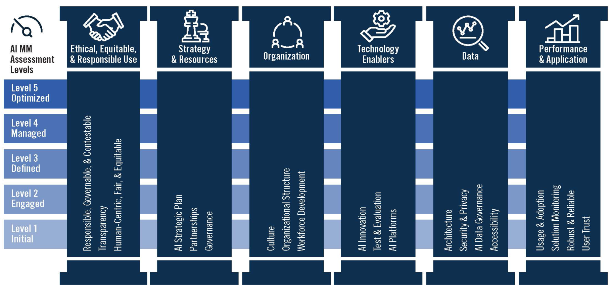

<!-- tags -->

## Maatregel

Breng de volwassenheid van je organisatie op het gebied van algoritmes in kaart.

## Toelichting

-   Om tot een passende algoritmegovernance voor een organisatie te komen, moet eerst worden vastgesteld wat op dit moment al is ingericht binnen een organisatie op het gebied van algoritmes.
-   Hiervoor kan een volwassenheidsmodel worden toegepast.
-   Op basis hiervan kunnen vervolgstappen worden gedefinieerd, zodat je een handelingsperspectief hebt om je organisatie te organiseren. Ook kunnen deze uitkomsten helpen bewustzijn over de uitdagingen te vergroten.
-   Het is denkbaar dat het realiseren van algoritmegovernance vraagt om een organisatieverandering. De noodzaak voor implementatie van de AI-Verordening kan hier een katalysator voor zijn. Pas daarom verandermanagementtechnieken toe.
-   Deel deze informatie met het bestuur en zorg dat hier bewustzijn ontstaat. Bepaal vervolgens hoe algoritmegovernance moet worden ingericht.
-   Het is aan te raden om verantwoordelijkheden te beleggen voor het realiseren van algoritmegovernance.

## Bronnen

## Bijbehorende vereiste(n)

<!-- Hier volgt een lijst met vereisten op basis van de in de metadata ingevulde vereiste -->

<!-- Let op! onderstaande regel met 'list_vereisten_on_maatregelen_page' niet weghalen! Deze maakt automatisch een lijst van bijbehorende verseisten op basis van de metadata  -->
??? expander "Bekijk alle vereisten"
    <!-- list_vereisten_on_maatregelen_page -->

## Risico

<!-- vul hier het specifieke risico in dat kan worden gemitigeerd met behulp van deze maatregel -->

## Voorbeelden van volwassenheidsmodellen

Er zijn verschillende modellen om het volwassenheidsniveau te bepalen. Deze modellen richten zich niet altijd specifiek op het beheer van algoritmes, maar kijken breder naar algoritmes in de organisatie of naar ethische vraagstukken. Governance is altijd een onderdeel van deze modellen.

### AI ethics maturity model van Krijger, Thuis, de Ruiter, Ligthart & Broekman (2023)

Het [AI ethics maturity model van Krijger, Thuis, de Ruiter, Ligthart & Broekman (2023)](https://link.springer.com/article/10.1007/s43681-022-00228-7) brengt de volwassenheid op verschillende niveau's in kaart op basis van zes categorieën:

-   awareness & culture
-   policy
-   governance
-   communication & training
-   pevelopment proces
-   tooling

### Het Datavolwassenheidsmodel van de IBDS

Het datavolwassenheidmodel van de Interbestuurlijke Datastrategie (IBDS) kijkt naar hoe goed organisaties omgaan met data. Dit model is ook belangrijk voor kunstmatige intelligentie (AI), omdat data daar een grote rol speelt. Het model heeft een [beslishulp datavolwassenheid](https://realisatieibds.nl/groups/view/c23ab74c-adb4-424e-917d-773a37968efe/kenniscentrum-van-de-ibds/wiki/view/2447d2a8-6c48-468d-9739-00772688853f/beslishulp-datavolwassenheid) waarmee bepaald kan worden hoe volwassen een organisatie is met data. IBDS biedt ook een [gids](https://realisatieibds.nl/page/view/ad94d97c-4d48-443c-aedd-235b2d0ca8b6/wegwijzer-volwassenheidsmodellen) met verschillende manieren om de datavolwassenheid in kaart te brengen.

### Innovatie en volwassenheid

Het gebruik van algoritmes wordt vaak gezien als een vorm van innovatie. Hoe kan AI helpen bij het ondersteunen van nieuwe ideeën en het vinden van nieuwe toepassingen? Een voorbeeld van een volwassenheidsmodel over innovatie is de [Innovatie Maturity Scan](https://www.rijksorganisatieodi.nl/innoveren-met-impact/onze-services/innovatie-maturity-scan) van Innoveren met Impact.

### MITRE AI Maturity Model en Organizational Assessment Tool

Het [AI Maturity Model](https://www.mitre.org/news-insights/publication/mitre-ai-maturity-model-and-organizational-assessment-tool-guide) en de bijbehorende Organizational Assessment Tool zijn ontwikkeld door de Amerikaanse organisatie [MITRE](https://www.mitre.org/). MITRE is een non-profitorganisatie en enigzins vergelijkbaar met het Nederlandse TNO. Dit volwassenheidsmodel onderscheidt een zestal pijlers in de AI volwassenheid van een organisatie en daarbij een vijftal volwassenheidsniveaus. Het volwassenheidsmodel en assessment zijn goed gedocumenteerd.

------------------------------------------------------------------------

Heb je een voorbeeld of best practice, laat het ons weten via [algoritmes\@minbzk.nl](mailto:algoritmes@minbzk.nl){.email}
