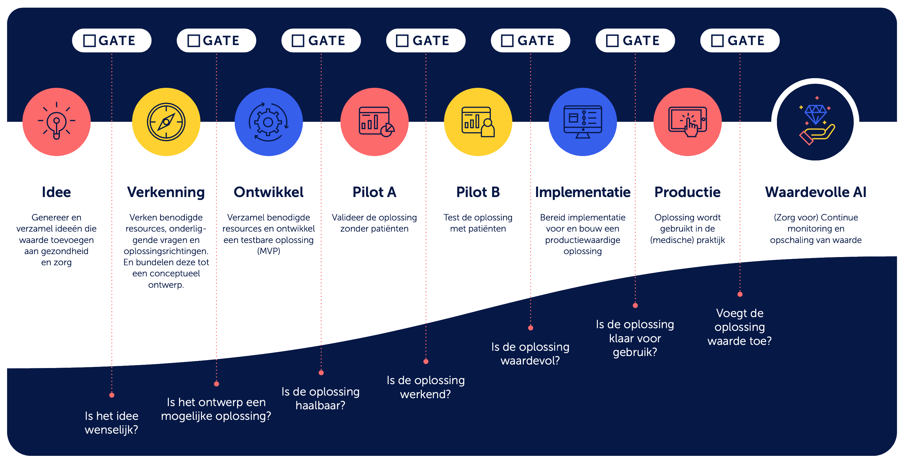

<!-- tags -->

## Maatregel

Richt vaste beslismomenten en controlepunten in in de algoritmelevenscyclus.

## Toelichting
- Algoritmegovernance kan op de levenscyclus aansluiten door 'gates' of controlepunten in te voeren. Deze gates bevatten belangrijke mijlpalen om te beoordelen of de juiste taken zijn uitgevoerd, of ethische afwegingen zijn gemaakt, of documentatie heeft plaatsgevonden en of akkoord is ingewonnen (go/no-go moment) bij de verantwoordelijke(n) om naar de volgende fase te mogen.
- Het is belangrijk om te weten dat toepassing van deze ‘gates’ niet altijd hetzelfde is. Dit kan namelijk verschillen afhankelijk van het type algoritme.
- Een hoog-risico-AI systeem moet aan meer vereisten voldoen dan een niet impactvol algoritme. Een hoog-risico AI-systeem moet daarom binnen de gates worden getoetst op meer onderdelen dan een niet impactvol algoritme.

## Risico
Als er geen controlepunten aanwezig zijn in de levenscyclus van een algoritmegovernance kan het moeilijk zijn om te traceren waar sommige problemen ontstaan en kunnen simpele wijzigingen in het proces over het hoofd worden gezien.

## Bijbehorende vereiste(n) { data-search-exclude }
<!-- Hier volgt een lijst met vereisten op basis van de in de metadata ingevulde vereiste -->
<!-- Let op! onderstaande regel met 'list_vereisten_on_maatregelen_page' niet weghalen! Deze maakt automatisch een lijst van bijbehorende verseisten op basis van de metadata  -->
??? expander "Bekijk alle vereisten"
    <!-- list_vereisten_on_maatregelen_page -->

## Bronnen
- [Hulpmiddel handelingsruimte waardevolle AI in de zorg](https://nlaic.com/wp-content/uploads/2022/06/04a)
- [AI lifecycle management in de zorg, Nederlandse AI Coalitie](https://nlaic.com/toepassingsgebieden/samenvatting-life-cycle-management/)
- UWV Beleidsdocument model risico management, Modellevenscyclus (blz 21), 29 september 2021
- [Toetsingskader Algemene Rekenkamer, 1.07](https://www.rekenkamer.nl/onderwerpen/algoritmes/documenten/publicaties/2024/05/15/het-toetsingskader-aan-de-slag)

## Voorbeelden

Hieronder volgen twee voorbeelden van hoe governance effectief kan worden geïntegreerd in de levenscyclus van algoritmen en AI-modellen:

!!! example "Ministerie van Volksgezondheid, Welzijn en Sport  - Tool Handelingsruimte Waardevolle AI"

	Het Ministerie van Volksgezondheid, Welzijn en Sport (VWS) heeft een hulpmiddel ontwikkeld voor het begeleiden van het innovatieproces: _Tool Handelingsruimte Waardevolle AI_. Binnen de tool wordt gebruikgemaakt van verschillende fases waarbij iedere fase een eigen doel in het proces heeft. Zodra een doel afgerond is, is er een faseovergang (gate) met een checklist voordat men naar de volgende fase kan gaan. Hierbij worden verschillende eisen gesteld op het gebied van waarde, toepassing, ethiek, techniek en verantwoordelijkheid. Zodra aan alle eisen is voldaan kan de volgende fase gestart worden. Op deze manier kan bij iedere fase beoordeeld worden of er moet worden bijgestuurd. Dit proces vindt plaats vanaf de [probleemanalyse-fase](../../levenscyclus/probleemanalyse.md) tot [monitoring- en beheer](../../levenscyclus/monitoring-en-beheer.md).

	

	Bron: [Hulpmiddel Handelingsruimte Waardevolle AI voor gezondheid en zorg] (https://nlaic.com/download/04a-hulpmiddel-handelingsruimte-waardevolle-ai-voor-gezondheid-en-zorg/)

!!! example "UWV - Modellevenscyclus"

	Het UWV heeft in 2021 haar modellevenscyclus toegelicht in een gepubliceerd beleidsdocument. Hierin wordt uitgelegd dat bij sommige controlepunten ook een stap terug gedaan kan worden in de cyclus als dit nodig blijkt. Bij iedere stap wordt een beschrijving gegeven. Daarnaast wordt ook toegelicht wat de noodzakelijke procedures zijn en wie hiervoor verantwoordelijk is. Deze procedures worden ook grafisch toegelicht per stap in de cyclus. Hieronder is een algemeen grafische weergave te zien van de algehele modellevenscyclus bestaande uit 8 stappen.

    

 	Bron: [Algoritmelevenscyclus – UWV, pagina 21]( https://www.uwv.nl/overuwv/Images/bijlage-4-beslissing-op-bezwaar-op-wob-verzoek-software-en-algoritmes.pdf)

Heb je een ander voorbeeld of best practice, laat het ons weten via [algoritmes@minbzk.nl](mailto:algoritmes@minbzk.nl).
